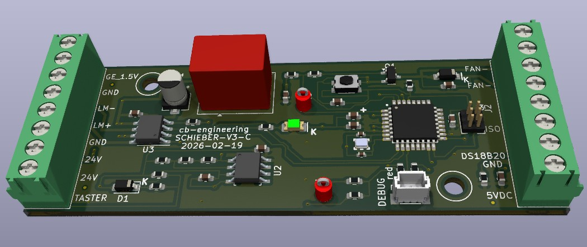
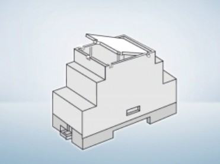

# FAN-Control – Lüfter- und Schiebersteuerung

> Kompakte Embedded-Steuerung für Lüfter und Abgasschieber eines Gasdurchlauferhitzers,
> entwickelt mit eigener Hardware in **KiCad** und Firmware in **AVRPascal** auf einem **ATmega328PB**.



---

## Überblick

**FAN-Control** überwacht den Betriebszustand eines Gasdurchlauferhitzers und steuert automatisch:

- den **Abgasschieber** (motorisch, via H-Brücke) – öffnet beim Einschalten des Geräts
- den **Lüfter** – schaltet temperaturabhängig zu

Die Steuerung erkennt den Gerätezustand über ein **Analogsignal**, misst die **Abgastemperatur** mit einem DS18B20-Sensor und reagiert zusätzlich auf einen **manuellen Taster**.

---

## Systemarchitektur

```
24 V DC
   │
   ▼
Spannungsaufbereitung
   │
   ▼
ATmega328PB (PD2–PD7)
   ├── PD3 ◄── LM358 (Analogsignal Gerätezustand)
   ├── PD4 ◄── DS18B20 (1-Wire Temperatursensor)
   ├── PD7 ◄── Taster (manuell Ein/Aus)
   ├── PD5/PD6 ──► DRV8871DDA (H-Brücke → Schieber-Motor)
   └── PD2 ──► AO3400A (MOSFET → Lüfter)
```

---

## Hardware

### Hauptkomponenten

| Bauteil             | Bezeichnung     | Funktion                              |
|---------------------|-----------------|---------------------------------------|
| Mikrocontroller     | ATmega328PB     | Zentrale Steuerlogik                  |
| Temperatursensor    | DS18B20         | 1-Wire Temperaturmessung              |
| Motortreiber        | DRV8871DDA      | H-Brücke für Schieber-Motor           |
| Lüftertreiber       | AO3400A         | N-Kanal MOSFET zum Schalten des Lüfters |
| Signalaufbereitung  | LM358           | Operationsverstärker für Geräte-Signal |
| Versorgung          | 24 V DC         | Externe Versorgungsspannung           |
| Gehäuse             | Bernic Series 350 | DIN-Schienenmontage               |

### Gehäuse



### Pin-Belegung (ATmega328PB)

| Pin  | Port | Richtung | Funktion                                    |
|------|------|----------|---------------------------------------------|
| PD2  | D2   | OUTPUT   | Lüfter Ein/Aus (via AO3400A MOSFET)         |
| PD3  | D3   | INPUT    | Betriebssignal Durchlauferhitzer (via LM358)|
| PD4  | D4   | I/O      | DS18B20 1-Wire Datenleitung                 |
| PD5  | D5   | OUTPUT   | DRV8871 IN1 – Motor Auf                     |
| PD6  | D6   | OUTPUT   | DRV8871 IN2 – Motor Zu                      |
| PD7  | D7   | INPUT    | Taster – manuell Schieber Ein/Aus           |

---

## Firmware

### Zustandslogik

Die Haupt-Schlaufe läuft kontinuierlich mit einer Pause von **250 ms** pro Zyklus.

```
┌─────────────────────────────────────────────────┐
│  Einschalten (SchieberOnOff = TRUE) wenn:        │
│    GEon = 1  (Durchlauferhitzer läuft)           │
│    OR  Temperatur > 40 °C                        │
│    OR  Taster aktiv                              │
├─────────────────────────────────────────────────┤
│  Ausschalten (SchieberOnOff = FALSE) wenn:       │
│    GEon = 0  AND  Temperatur ≤ 40 °C            │
│    AND  Taster nicht aktiv                       │
└─────────────────────────────────────────────────┘
```

**Temperatur-Schwellwert:** `TempFan = 40 °C` (konfigurierbar als Konstante im Quellcode)

**Fehlertoleranz:** Bei einem Lesefehler des DS18B20 (`seCRCError`, `seNoSensor`) bleibt der zuletzt gültige Temperaturwert (`lastGoodTemp`) erhalten.

### Motor-Ansteuerung

Der DRV8871-Motortreiber wird über zwei Ausgänge angesteuert:

| Befehl | IN1 | IN2 | Lüfter |
|--------|-----|-----|--------|
| Schieber AUF | HIGH | LOW | EIN |
| Schieber ZU  | LOW | HIGH | AUS |

Zwischen den Schaltzuständen werden kurze Mikrosekunden-Pausen eingehalten, um Stromspitzen zu vermeiden.

### DS18B20 – Eigene 1-Wire Implementierung

Der Sensor wird über **direktes Port-Bit-Banging** (DDRD / PORTD / PIND) ohne externe Bibliothek angesprochen. Die Implementierung beinhaltet:

- 1-Wire Reset mit Präsenzsignal-Erkennung
- Bit-genaues Read/Write mit µs-Timing
- **CRC8 Dallas-Prüfsumme** zur Datenvalidierung
- Fehlerbehandlung über den Typ `TSensorError`:

| Fehlercode     | Bedeutung                          |
|----------------|------------------------------------|
| `seNone`       | Kein Fehler                        |
| `seNoSensor`   | Sensor nicht erkannt (kein Präsenzsignal) |
| `seCRCError`   | Prüfsummenfehler                   |
| `seOutOfRange` | Temperaturwert ausserhalb −55…+125 °C |

---

## Projektstruktur

```
FAN-Control-mit-ATMEL-328P-programmiert-in-AVRPascal/
├── Hardware/
│   ├── 700000008-SCHIEBER-V3.kicad_sch   # Schaltplan
│   ├── 700000008-SCHIEBER-V3.kicad_pcb   # PCB-Layout
│   └── 700000008-SCHIEBER-V3.kicad_pro   # KiCad Projektdatei
│
├── Software/
│   ├── P_700000008_V3_A.pas              # Hauptprogramm
│   ├── DS18B20.pas                       # 1-Wire Sensor Unit
│   ├── P_700000008_V3_A.hex              # Flash-fertige Hex-Datei
│   ├── P_700000008_V3_A.elf              # ELF Debug-Binary
│   └── P_700000008_V3_A.bin              # Rohes Binärimage
│
├── images/
│   ├── render.jpg                        # PCB 3D-Render
│   └── bernicSeries350.jpg               # Gehäuse DIN-Schiene
│
├── LICENSE
└── readme.md
```

---

## Voraussetzungen

### Hardware

- Zielhardware mit **ATmega328PB**
- 24 V DC Versorgung
- DS18B20 Temperatursensor
- Abgasschieber mit geeignetem DC-Motor
- Lüfter
- Programmer: **USBasp** oder kompatibel

### Software

- [AVRPascal / Free Pascal AVR Toolchain](https://www.freepascal.org/)
- [avrdude](https://github.com/avrdudes/avrdude) zum Flashen
- [KiCad](https://www.kicad.org/) für Änderungen an der Hardware

---

## Build & Flash

### Flashen (fertige Hex-Datei)

```bash
avrdude -c usbasp -p m328pb -P usb -U flash:w:Software/P_700000008_V3_A.hex
```

> **Hinweis:** Den Partcode `-p m328pb` verwenden (nicht `m328p`), da es sich um den **ATmega328PB** handelt.

### Fuse-Konfiguration

Die Fuse-Bits müssen zur Taktquelle passen:

| Fuse   | Empfehlung                        |
|--------|-----------------------------------|
| CKSEL  | Externer 16 MHz Quarz             |
| CKDIV8 | Deaktiviert (kein Vorteiler)      |
| BODLEVEL | Je nach Anwendung (empfohlen: 2,7 V) |

Beispiel (externer 16 MHz Quarz, BOD 2,7 V):

```bash
avrdude -c usbasp -p m328pb -P usb \
  -U lfuse:w:0xFF:m \
  -U hfuse:w:0xD9:m \
  -U efuse:w:0xFF:m
```

> ⚠️ Falsche Fuse-Einstellungen können den Mikrocontroller scheinbar unbrauchbar machen. Vor dem Setzen unbedingt mit dem Datenblatt abgleichen.

---

## Projektstatus

| Bereich      | Status          |
|--------------|-----------------|
| Hardware     | ✅ Entwickelt    |
| Firmware     | ✅ Lauffähig     |
| Taktquelle   | ✅ Externer 16 MHz Quarz getestet |
| Flash-Prozess | ✅ USBasp / avrdude erfolgreich |
| Feldbetrieb  | 🔄 In Erprobung |

---

## Mögliche Erweiterungen

- Serielle Diagnoseausgabe (UART) für Temperatur- und Zustandslogs
- Fehlererkennung mit Status-LED oder Summerton
- Parametrierung von `TempFan` über Taster oder EEPROM
- Watchdog-Timer für erhöhte Ausfallsicherheit
- Stückliste (BOM) als PDF oder CSV

---

## Sicherheitshinweis

Dieses Projekt ist **kein zertifiziertes Sicherheitsprodukt** und **kein freigegebenes Seriengerät**.
Der Einsatz erfolgt ausschliesslich auf eigene Verantwortung – insbesondere bei Anwendungen mit
Gasgeräten, Wärmequellen oder beweglichen Aktoren. Vor dem Praxiseinsatz müssen alle
elektrischen, thermischen und sicherheitstechnischen Aspekte eigenständig geprüft werden.

---

## Lizenz

MIT License – siehe [LICENSE](LICENSE)

---

## Autor

**Christof Biner** ([@staibisser](https://github.com/staibisser))
