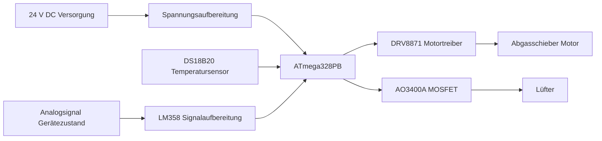

# 🔥 FanControl – Lüfter- und Schiebersteuerung

Kompakte Embedded-Steuerung für Lüfter und Abgasschieber eines Gasdurchlauferhitzers.  
Das Projekt kombiniert eigene Hardwareentwicklung in **KiCad** mit Firmware in **AVRPascal** auf einem **ATmega328PB**.

Der Fokus liegt auf einer durchgängigen Embedded-Lösung von der Elektronik bis zur realen Anwendung:

**Elektronik → Firmware → Aktorik / Sensorik → Praxisbetrieb**

---

## 📌 Überblick

**FanControl** ist eine spezialisierte Steuerung für:

- die Erfassung der Abgas- bzw. Systemtemperatur
- die Erkennung des Betriebszustands eines Gasdurchlauferhitzers
- die Ansteuerung eines motorischen Abgasschiebers
- die temperaturabhängige Zuschaltung eines Lüfters

Das Projekt dient als technisches Referenzdesign für kompakte Steuerungen im Bereich Embedded Systems, Sensorik und Aktorik.

---

## 🚀 Features

- Temperaturmessung mit **DS18B20** über **1-Wire**
- Auswertung eines **Analogsignals** zur Betriebserkennung
- Motorsteuerung für den **Abgasschieber**
- Temperaturabhängige **Lüftersteuerung**
- Versorgung über **24 V DC**
- Kompakter Aufbau für **DIN-Schienenmontage**
- Eigene Hardwareentwicklung in **KiCad**
- Firmware in **AVRPascal** für AVR-Mikrocontroller

---

## 🧱 Systemarchitektur



---

## 🔩 Hardware

### Hauptkomponenten

- **MCU:** ATmega328PB
- **Temperatursensor:** DS18B20
- **Motortreiber:** DRV8871DDA
- **Lüftertreiber:** AO3400A
- **Signalaufbereitung:** LM358
- **Versorgung:** 24 V DC
- **Gehäuse:** Bernic Series 350 für DIN-Schiene

### Hardware-Funktionen

Die Hardware ist für robuste Einbindung in eine kompakte Steuerung ausgelegt:

- Einlesen der Temperatur über 1-Wire
- Aufbereitung externer Signale über Operationsverstärker
- Sichere Motoransteuerung über H-Brückentreiber
- Schalten eines Lüfters über MOSFET
- Montage in einem praxisgerechten Hutschienengehäuse

---

## 💻 Firmware

Die Firmware wurde in **AVRPascal** umgesetzt und übernimmt die komplette Ablaufsteuerung.

### Firmware-Aufgaben

- Initialisierung der Hardware
- Temperaturmessung über DS18B20
- Erkennung des Anlagenzustands
- Steuerung des Schiebermotors
- Zuschaltung des Lüfters abhängig von Temperatur und Zustand
- Ablauf- und Zustandslogik für den sicheren Betrieb

---

## 📁 Projektstruktur

```text
FanControl/
├── Hardware/                 # KiCad Projektdateien
│   ├── Schematic/           # Schaltpläne
│   ├── PCB/                 # Layout / Board
│   └── Production/          # Gerber, BOM, Fertigungsdaten (optional)
│
├── Software/                # AVRPascal Firmware
│   ├── src/                 # Quellcode
│   ├── build/               # Build-Artefakte (optional, nicht committen)
│   └── docs/                # Software-Dokumentation (optional)
│
├── Images/                  # Bilder für GitHub README
│   ├── pcb.png
│   ├── schematic.png
│   └── enclosure.png
│
└── README.md
```

## ⚙️ Voraussetzungen

### Hardware

- Zielhardware mit **ATmega328PB**
- 24-V-Versorgung
- DS18B20
- Abgasschieber mit geeignetem Motor
- Lüfter
- Programmer, z. B. **USBasp**

### Software

- **AVRPascal / Free Pascal Toolchain**
- **avrdude** zum Flashen
- **KiCad** für Änderungen an der Hardware

---

## 🔧 Build & Flash

Die Firmware wird mit der verwendeten AVRPascal-/FPC-Toolchain erzeugt und anschließend mit `avrdude` auf den Mikrocontroller geladen.

### Fuse-Konfiguration

Die Fuse-Bits müssen zur realen Hardware passen, insbesondere bei:
- externer **16 MHz Quarz**
- Brown-out je nach Anwendung aktiviert oder deaktiviert

> Achtung: Falsche Fuse-Einstellungen können den Controller scheinbar "unbrauchbar" machen, bis korrekt neu programmiert wird.

---

## 🧪 Projektstatus

Aktueller Stand des Projekts:

- Hardware entwickelt
- Firmware lauffähig
- Betrieb mit externer Taktquelle getestet
- Flashen mit USBasp / avrdude erfolgreich

---

## ⚠️ Wichtiger Hinweis

Dieses Repository beschreibt ein technisches Projekt aus dem Umfeld von Steuerung, Temperaturerfassung und Aktorik.  
Es ist **keine zertifizierte Sicherheitssteuerung** und **kein freigegebenes Serienprodukt**.

Der Einsatz erfolgt vollständig auf eigene Verantwortung, insbesondere bei Anwendungen mit:

- Gasgeräten
- Wärmequellen
- beweglichen Aktoren
- sicherheitsrelevanten Funktionen

Vor praktischem Einsatz müssen alle elektrischen, thermischen und sicherheitstechnischen Aspekte eigenständig geprüft werden.

---

## 🎯 Ziel des Projekts

Dieses Projekt soll zeigen:

- wie eine eigene Embedded-Hardware mit **KiCad** entwickelt wird
- wie sich eine praxisnahe Steuerung mit **AVRPascal** umsetzen lässt
- wie Sensorik, Logik und Aktorik in einem kompakten System zusammenspielen
- wie ein reales Embedded-Projekt sauber dokumentiert werden kann

---

## 🛣️ Mögliche Erweiterungen

- Status-LEDs oder Display
- Serielle Diagnoseausgabe
- Fehlererkennung für Sensor und Aktor
- Parametrierung über Taster oder Schnittstelle
- Logging von Temperatur- und Zustandsdaten

---

## 📄 Lizenz

MIT License

---

## 👨‍💻 Autor

**Christof Biner**
